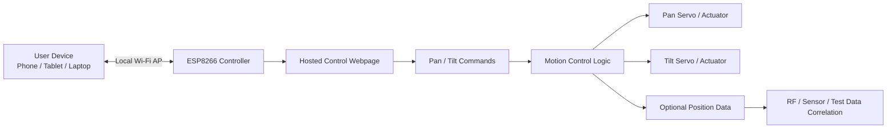

# Pan-Tilt-Platform

An ESP8266-controlled pan/tilt test platform intended for browser-based precision positioning.

The original goal was to create a small network-controlled platform that could broadcast its own local Wi-Fi access point, host a simple control webpage, and allow a user to adjust platform orientation from a phone, tablet, or laptop browser.

This project was intended for controlled positioning during RF, sensor, antenna, camera, or directional testing where repeatable pan/tilt orientation is useful.

## Concept Images

### Full Assembly


### Base Internals


### Tripod Interface


## Project Status

Prototype / paused.

The core concept is still valid for standalone use, but the original deployment environment introduced network restrictions that made the local-access-point control model impractical. In environments where unmanaged local Wi-Fi access points are allowed, this approach should still be usable.

This repo is preserved as a practical ESP8266 pan/tilt control concept and starting point for future work.

## Intended Use

The platform was designed to support:

* remote pan/tilt positioning from a web browser
* repeatable orientation changes during testing
* separation between the operator and the test article
* possible correlation of platform angle/orientation with RF propagation or measurement data
* low-cost embedded control using common maker hardware

Possible applications include:

* antenna orientation testing
* RF propagation experiments
* camera aiming
* sensor positioning
* lab fixture control
* educational pan/tilt demos

## Original Control Concept

The intended operating mode was:

1. ESP8266 starts as a local Wi-Fi access point
2. User connects directly to the ESP8266 network
3. ESP8266 serves a local control webpage
4. Webpage sends pan/tilt commands to the controller
5. Controller updates servo or actuator positions
6. Position/orientation data can be recorded or correlated with external measurements

## System Overview



## Processing Loop


## Hardware Concept

The general hardware concept is:

* ESP8266 development board
* pan servo or motorized axis
* tilt servo or motorized axis
* suitable 5 V power supply for motors/servos
* separate or regulated logic power as needed
* mechanical pan/tilt platform or bracket
* optional position feedback, if added later

## Mechanical Design / CAD Files

The 3D model and mechanical design files are hosted on GrabCAD:

[Pan-Tilt Platform on GrabCAD](https://grabcad.com/library/pan-tilt-platform-2)

The mechanical design includes:

- base housing
- internal electronics and motor mounting features
- rotating pan stage
- tilt frame
- honeycomb-style mounting surface
- tripod interface
- 1/4-20 embedded nut retention / jam nut design

## Motor and Power Notes

This design uses common 28BYJ-48 5 V geared stepper motors.

These motors are inexpensive and widely available, making them useful for lightweight positioning fixtures and proof-of-concept builds. They should not be treated as high-torque actuators.

Typical published 28BYJ-48 specifications include:

| Parameter | Typical Value |
|---|---|
| Rated voltage | 5 V DC |
| Motor type | 4-phase unipolar geared stepper |
| Step / stride angle | 5.625° / 64 |
| Approximate theoretical output resolution | ~0.088° per step |
| Published pull-in torque | ~300 gf·cm |

The theoretical step resolution is not the same as real platform accuracy. Actual pointing accuracy will be affected by gear backlash, 3D-printed part tolerances, bearing fit, flex, load balance, and motor quality.

### Payload Limit

No formal payload rating has been established.

Until tested, this platform should be treated as suitable for lightweight test articles only, such as:

- small antennas
- compact sensors
- small reflectors
- lightweight camera modules
- test coupons or RF samples

Payload capacity depends on the weight of the mounted object, its center of mass, tilt angle, print material, bearing fit, motor quality, and power supply performance.

### Estimated Current Draw

Approximate planning values:

| Component | Estimated Current |
|---|---|
| Wemos D1 Mini / ESP8266 | plan for 250–500 mA available at 5 V input |
| One 28BYJ-48 motor + ULN2003 driver | ~250–300 mA while energized |
| Two 28BYJ-48 motors + drivers | ~500–600 mA while energized |

A 5 V supply rated for at least 1.5 A is recommended. A 5 V / 2 A supply gives more margin.

Stepper motors may continue drawing current while holding position, even when they are not visibly moving. Do not rely on a weak USB port or marginal regulator for final testing.

## Power Notes

Do not power servos directly from the ESP8266 board regulator unless the current draw is known to be safe.

For most real builds:

* use a dedicated 5 V supply for servos or actuators
* connect grounds between servo power and ESP8266 logic
* keep wiring short and secure
* account for stall current
* add bulk capacitance near the servo supply if needed

## Network Notes

The original design assumes the ESP8266 can create a local Wi-Fi access point.

That works well for standalone bench use, but it may not work in restricted environments where:

* unmanaged wireless access points are prohibited
* devices must use a managed network
* VPN enforcement prevents direct local connections
* DIY hardware cannot be connected to the network
* wireless policy blocks peer-to-peer or local AP usage

In those cases, a different control model may be required.

## Possible Future Control Options

If local Wi-Fi AP control is not allowed, possible alternatives include:

### USB Serial Control

Use a laptop or single-board computer connected directly over USB serial.

Pros:

* simple
* no wireless policy issue
* easy to log commands and positions

Cons:

* requires a nearby host computer
* less convenient for remote browser control

### Wired Ethernet Controller

Move from ESP8266 to a board with Ethernet support.

Pros:

* more acceptable in some lab environments
* stable connection
* easier to integrate with logging systems

Cons:

* still may require network approval
* more hardware complexity

### Local Single-Board Computer Bridge

Use a Raspberry Pi or similar device as a local controller and webpage host.

Pros:

* can host a richer UI
* can log data locally
* can control the pan/tilt device over USB, UART, I2C, or GPIO

Cons:

* adds another device
* more setup and power requirements

### Offline Manual Control

Use buttons, rotary encoders, or a small display for local control.

Pros:

* no network dependency
* simple and robust

Cons:

* loses browser control
* harder to integrate with external measurement data

## Why This Project Stalled

The project stalled because the original browser-based local AP control model was not compatible with the intended deployment environment.

The platform concept still works in principle, but the control path needs to match the environment where the platform is actually used.

This is a useful engineering lesson: sometimes the embedded hardware works, but the deployment constraints change the system architecture.

## Planned Improvements

Possible future improvements:

* document the exact hardware used
* add wiring diagram
* add browser UI screenshots
* add mechanical photos or CAD links
* add position limits and calibration notes
* add serial command fallback
* add data logging for pan/tilt orientation
* add RF measurement correlation workflow
* add enclosure or mounting design
* link to matching GrabCAD models if mechanical files are published

## Repository Structure

This project follows Arduino IDE conventions.

The main sketch should remain in a folder with the same name as the `.ino` file. Additional `.h`, `.c`, or `.cpp` files may be added as needed, but the `.ino` file remains the Arduino entry point.

Suggested structure:

```text
Pan-Tilt-Platform/
├── README.md
├── LICENSE
├── Pan-Tilt-Platform.ino
├── docs/
│   ├── wiring-notes.md
│   ├── network-notes.md
│   └── control-notes.md
└── images/
    └── platform-concept.png
```

## Safety Notes

This project controls moving hardware.

Use reasonable care:

* keep fingers, wires, and loose parts clear of moving joints
* define software limits before testing full travel
* avoid overdriving servos or mechanical stops
* use an appropriate power supply
* secure the platform before operation
* disconnect power when adjusting wiring or mechanics

## Limitations

* prototype / work-in-progress
* local AP control may not be usable in restricted network environments
* position accuracy depends on actuator choice and mechanical design
* no production-readiness claim
* no warranty or support commitment

## License

This project is released under the MIT License.

You are free to use, modify, and adapt it for your own projects. No warranty is provided, and no ongoing support or maintenance is implied.
