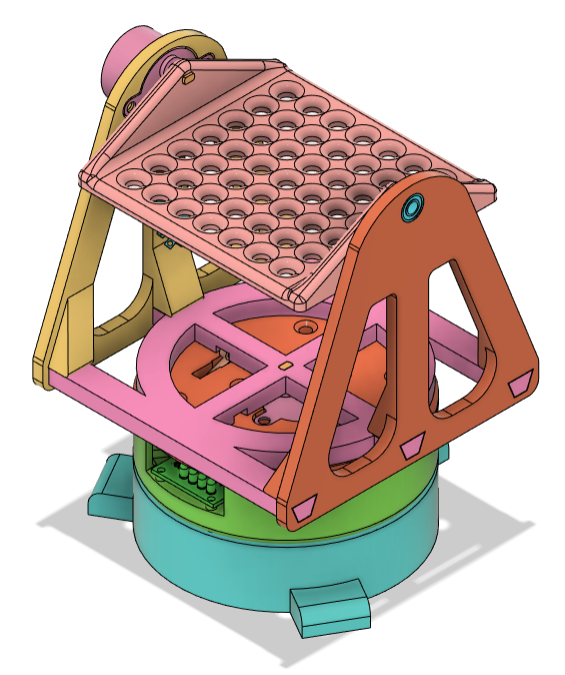
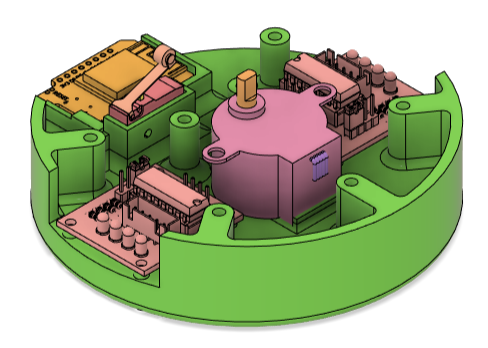
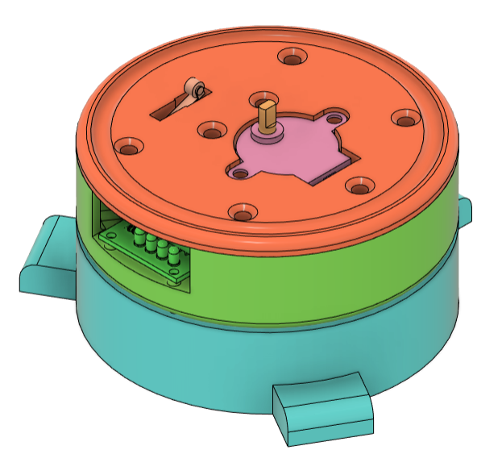
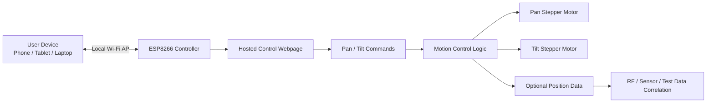
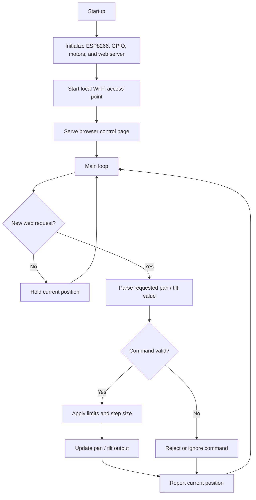

# Pan-Tilt-Platform

An ESP8266-controlled pan/tilt test platform intended for browser-based precision positioning.

The original goal was to create a small network-controlled platform that could broadcast its own local Wi-Fi access point, host a simple control webpage, and allow a user to adjust platform orientation from a phone, tablet, or laptop browser.

This project was intended for controlled positioning during RF, sensor, antenna, camera, or directional testing where repeatable pan/tilt orientation is useful.

## Project Status

Prototype / paused.

The mechanical design is developed enough to document and share, but the original browser-based local-access-point control model was not compatible with the intended deployment environment.

The core concept is still valid for standalone use, especially in environments where unmanaged local Wi-Fi access points are allowed.

## Concept Images

### Full Assembly



### Base Internals



### Tripod Interface



## Intended Use

The platform was designed to support:

- remote pan/tilt positioning from a web browser
- repeatable orientation changes during testing
- separation between the operator and the test article
- possible correlation of platform angle/orientation with RF propagation or measurement data
- low-cost embedded control using common maker hardware

Possible applications include:

- antenna orientation testing
- RF propagation experiments
- camera aiming
- sensor positioning
- lab fixture control
- educational pan/tilt demos

## System Overview



## Processing Loop



## Hardware Concept

The general hardware concept is:

- Wemos D1 Mini / ESP8266 controller
- two 28BYJ-48 5 V geared stepper motors
- ULN2003-style stepper driver boards
- mechanical pan/tilt platform
- honeycomb-style mounting surface
- limit switches to prevent excessive travel
- tripod interface using a 1/4-20 threaded mount
- suitable 5 V power supply for motors and controller

## Mechanical Design / CAD Files

The 3D model and mechanical design files are hosted on GrabCAD:

[Pan-Tilt Platform on GrabCAD](https://grabcad.com/library/pan-tilt-platform-2)

The mechanical design includes:

- base housing
- internal electronics and motor mounting features
- rotating pan stage
- tilt frame
- honeycomb-style mounting surface
- tripod interface
- 1/4-20 embedded nut retention / jam nut design

## Documentation

Additional project notes are split into separate files:

- [Mechanical Design](docs/mechanical-design.md)
- [Motor and Power Notes](docs/motor-and-power-notes.md)
- [Network Control Notes](docs/network-control-notes.md)
- [Project Status and Future Work](docs/project-status.md)

## Repository Structure

This project follows Arduino IDE conventions.

The main sketch should remain in a folder with the same name as the `.ino` file. Additional `.h`, `.c`, or `.cpp` files may be added as needed, but the `.ino` file remains the Arduino entry point.

Suggested structure:

```text
Pan-Tilt-Platform/
├── README.md
├── LICENSE
├── Pan-Tilt-Platform.ino
├── docs/
│   ├── mechanical-design.md
│   ├── motor-and-power-notes.md
│   ├── network-control-notes.md
│   └── project-status.md
└── images/
    ├── PanTiltPlatform-Overall-Isometric.png
    ├── PanTiltPlatform-BaseInternals-Isometric.png
    └── PanTiltPlatform-Base-Isometric.png
```

## Safety Notes

This project controls moving hardware.

Use reasonable care:

- keep fingers, wires, and loose parts clear of moving joints
- define software limits before testing full travel
- avoid overdriving motors or mechanical stops
- use an appropriate power supply
- secure the platform before operation
- disconnect power when adjusting wiring or mechanics

## Limitations

- prototype / work-in-progress
- local AP control may not be usable in restricted network environments
- position accuracy depends on actuator choice and mechanical design
- no formal payload rating has been established
- no production-readiness claim
- no warranty or support commitment

## License

This project is released under the MIT License.

You are free to use, modify, and adapt it for your own projects. No warranty is provided, and no ongoing support or maintenance is implied.
