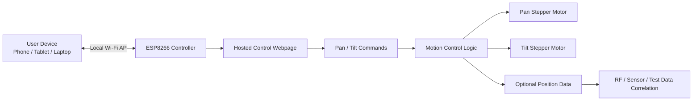
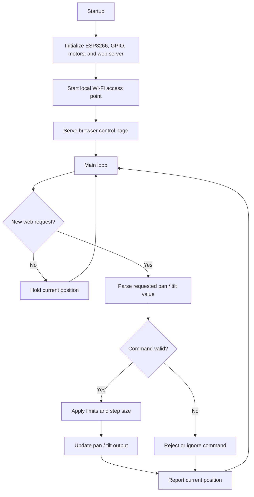

# Network Control Notes

This document explains the original ESP8266 network-control concept and why the project was paused.

## Original Control Concept

The original plan was to use the ESP8266 as a self-contained local controller.

The intended operating mode was:

1. ESP8266 starts as a local Wi-Fi access point
2. User connects directly to the ESP8266 network
3. ESP8266 serves a local control webpage
4. Webpage sends pan/tilt commands to the controller
5. Controller updates the pan and tilt motors
6. Position/orientation data can be recorded or correlated with external measurements

This would allow precision remote control from a phone, tablet, or laptop without requiring a separate application.

## Why Browser Control Was Useful

Browser-based control was attractive because it could provide:

- easy cross-platform access
- no custom desktop software requirement
- quick control from phones or tablets
- simple UI updates
- potential data entry or logging fields
- local control without internet dependency

## Intended Data Correlation

One of the original goals was to tie platform position or orientation to RF propagation data.

The basic idea was:

```text
pan angle + tilt angle + timestamp + RF measurement data
```

That could support repeatable directional testing, antenna experiments, or sensor-orientation studies.

## System Overview



## Processing Loop



## Deployment Constraint

The original design assumes the ESP8266 can create a local Wi-Fi access point.

That works well for standalone bench use, but it may not work in restricted environments where:

- unmanaged wireless access points are prohibited
- devices must use a managed network
- VPN enforcement prevents direct local connections
- DIY hardware cannot be connected to the network
- wireless policy blocks peer-to-peer or local AP usage

In those cases, the hardware concept may still be valid, but the control architecture needs to change.

## Why This Project Paused

The project paused because the original browser-based local AP control model was not compatible with the intended deployment environment.

The platform concept still works in principle, but the control path needs to match the environment where the platform is actually used.

This is a useful engineering lesson: sometimes the embedded hardware works, but deployment constraints change the system architecture.

## Possible Future Control Options

### USB Serial Control

Use a laptop or single-board computer connected directly over USB serial.

Pros:

- simple
- no wireless policy issue
- easy to log commands and positions
- avoids unmanaged local Wi-Fi

Cons:

- requires a nearby host computer
- less convenient for remote browser control
- may require a separate control script or serial terminal

### Wired Ethernet Controller

Move from ESP8266 to a board with Ethernet support.

Pros:

- more stable connection
- easier to integrate with logging systems
- may be more acceptable in some lab environments

Cons:

- still may require network approval
- more hardware complexity
- may need a different microcontroller or add-on Ethernet hardware

### Local Single-Board Computer Bridge

Use a Raspberry Pi or similar device as a local controller and webpage host.

Pros:

- can host a richer UI
- can log data locally
- can control the pan/tilt device over USB, UART, I2C, or GPIO
- can store position and RF measurement data together

Cons:

- adds another device
- more setup and power requirements
- more software maintenance

### Offline Manual Control

Use buttons, rotary encoders, a joystick, or a small display for local control.

Pros:

- no network dependency
- simple and robust
- useful for bench testing

Cons:

- loses browser control
- harder to integrate with external measurement data
- less convenient for remote operation

### Hybrid Control

Use local manual controls for basic movement and USB serial for logging/configuration.

Pros:

- practical fallback
- useful for development
- avoids full network dependency

Cons:

- less elegant than web control
- may require more panel hardware
- still needs software work

## Practical Recommendation

For future development, the most practical fallback is probably:

```text
USB serial command mode first,
then browser control later.
```

That would allow the mechanical platform and motor control logic to be validated without depending on Wi-Fi policy or network access.

Once the motion system works reliably, browser control can be reintroduced as an optional interface.
